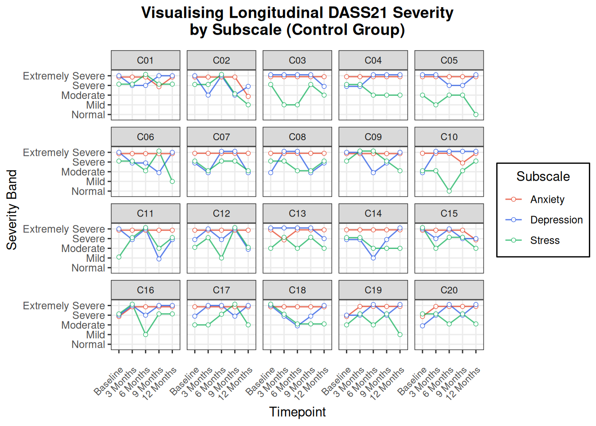

# Longitudinal Visualisation of DASS21 Subscale Scores

The DASS21 (Depression, Anxiety, and Stress Scales) is a self-report instrument commonly used in psychology and mental health research. This project shows how individual DASS21 subscale scores can be tracked over time, visualising how Depression, Anxiety, and Stress trajectories shift across five timepoints in a simulated clinical trial.

---

## What's in here

- **Data:** Simulated participant data across baseline, 3, 6, 9, and 12 months, structured to mirror typical REDCap exports
- **Visualisation:** Faceted plots by participant ID, showing each person's movement across severity bands over time
- **Tools:** Python (data generation), R + ggplot2 (visualisation), Quarto (reporting)

---

## Key Files

- `index.qmd` – Quarto report with inline discussion and visuals
- `data/simulated_dass21_full.csv` – Simulated dataset (Q1–Q21 + subscale scores)
- `R/dass21_facet_plot.R` – Modularised R script for reusable visualisation
- `figures/` – Sample output figures for control and intervention groups

---

## Report

[**Click here to view the report**](https://julian-chung.github.io/dass21-simulation-and-visualisation/)

> All data used in this project is simulated. The visualisation approach is adapted from real clinical trial workflows.
